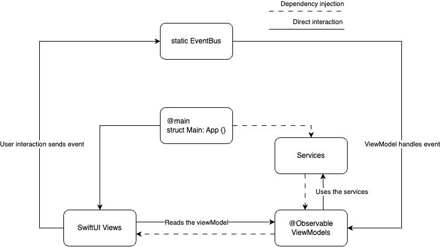

- This repo contains the basic iOS architecture used in my mobile apps.
- It's quite simple but seems to work well. 
- The key idea is that views only send events, the viewmodels decide how to act on those events.
- I just use a static eventbus with a list of subscribers to notify on each event.
It also serves as a good testbed if I need to understand some behaviour of SwiftUI.

### Diagram

